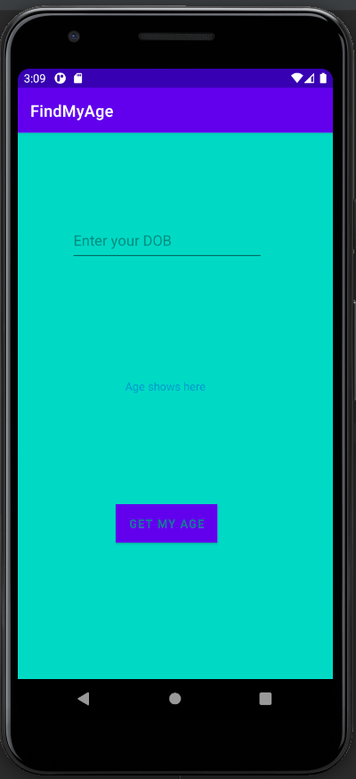
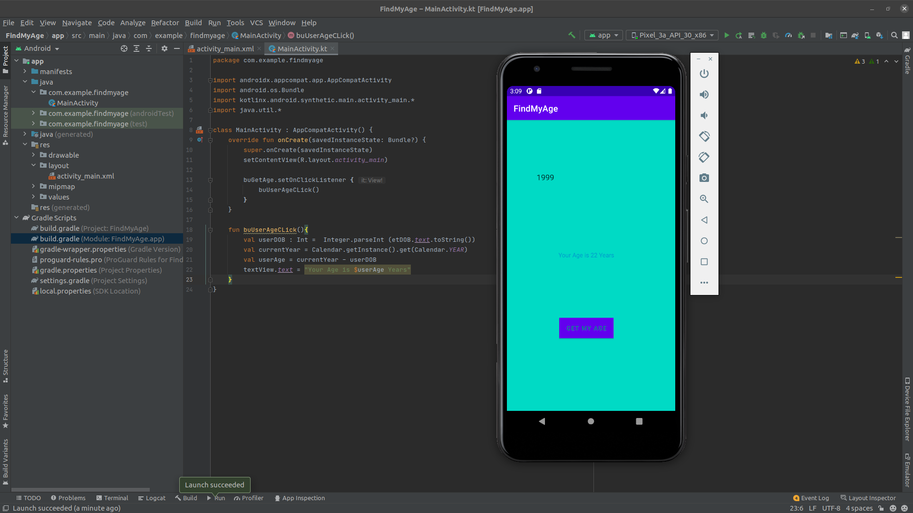

# Find My Age

Creating an android application using Kotlin

## Demo

1. First you need  to enter your Year of bearth
2. then click on GET MY AGE 
3. the app will do the math and then show you your current age

